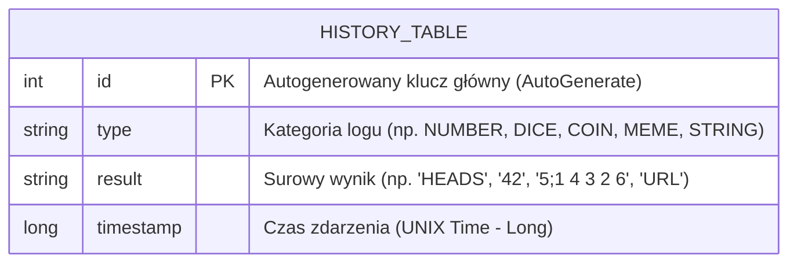
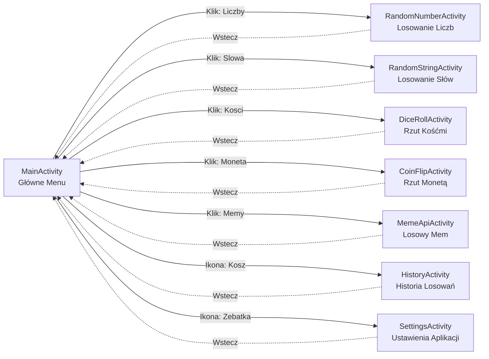

# Randomizer App - Dokumentacja Projektowa

## a. Opis aplikacji
**Randomizer** to wszechstronna i nowoczesna aplikacja na system Android, służąca do generowania losowych wyników. Aplikacja oferuje czysty interfejs użytkownika z płynnymi animacjami, odpowiedziami haptycznymi, wsparciem dla motywów oraz wielojęzycznością (polski/angielski). 
Inspiracją do podjęcia takowego tematu było zastąpienie asystenta Google (zawierającego wszystkie elementy tej aplikacji) przez asystenta AI Gemini. Uprzednio np. przy ustalaniu osoby mającej rozpoczynać dowolną grę planszową korzystaliśmy z tych funkcji, jednakże w nowym asystencie brakuje takich możliwości (oczywiście, że można go zapytać o podanie losowej liczby, ale temu nikt nie ufa).
Wielojęzyczność znalazła się tu z kolei, gdyż została z rozmachu zaciągnięta z projektu na webówki. :)

Główne funkcjonalności obejmują:
- Generowanie losowej liczby z ustalonego przez użytkownika przedziału (min-max).
- Losowanie jednego elementu z dowolnie tworzonej przez użytkownika listy łańcuchów znaków.
- Wirtualny rzut wieloma kośćmi K6 (do 12 kości).
- Rzut wirtualną monetą.
- Integrację z zewnętrznym API do pobierania losowych memów z internetu.
- Automatyczne zapisywanie wszystkich wykonanych akcji i wyników w lokalnej bazie danych, z możliwością ich podglądu lub wyczyszczenia w panelu "Historia".

## b. Opis podziału pracy
Zrobiłem wszystko samodzielnie :)

## c. Opis i diagram bazy danych
Aplikacja korzysta z wbudowanej, lokalnej relacyjnej bazy danych **SQLite** z wykorzystaniem narzutu architektonicznego (biblioteki) **Room**.
Baza danych przechowuje historię akcji użytkownika wewnątrz jednej tabeli o nazwie `history_table`. Architektura aplikacji (Data Layer) w celach optymalizacyjnych zakłada przechowywanie w bazie wyłącznie "surowych" metadanych (np. `HEADS` lub `5;1 4 3 2 6`). Właściwe wyświetlanie jest kalkulowane dynamicznie w warstwie prezentacji, co gwarantuje pełną odporność bazy danych na późniejsze zmiany języka interfejsu w ustawieniach.

## d. Schemat nawigacji po aplikacji
Aplikacja wykorzystuje model klasyczny wieloekranowy (Multi-Activity Navigation). Ekranem głównym (HUB) jest `MainActivity`, zawierający układ kafelkowy. Nawigacja opiera się o tzw. *Explicit Intents*, rozsyłając użytkownika do pobocznych ekranów i umozliwiając zawsze bezpieczny powrót (przycisk w lewym górnym rogu) niszcząc aktywność podrzedną (`finish()`).

